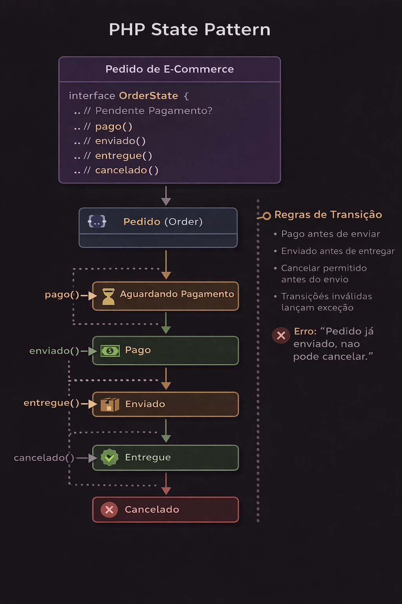

# Design Patterhs With PHP

## Behavioral

### Chain of Responsibility

The Chain of Responsibility pattern allows a request to pass through a sequence of handlers, where each handler has the opportunity to process the request or delegate it to the next handler in the chain.

Each handler focuses on a single responsibility, promoting separation of concerns and making the system easier to extend and maintain. If a handler cannot fully process the request, it forwards it to the next handler until the request is handled or the chain ends.

In this example, the request flows through a validation pipeline where different handlers perform specific security checks, such as authentication, input sanitization, and protection against common attacks like SQL Injection and XSS, before reaching the final handler that executes the main logic.

### Strategy

Defines a family of algorithms, encapsulates each one, and makes them interchangeable. The context can switch between strategies at runtime, allowing the behavior of the system to change without modifying the code that uses it.

### Template Method

Defines the skeleton of an algorithm in a base class while allowing subclasses to override specific steps. This ensures a consistent workflow while enabling customization of certain parts of the process.

### Command

Turns a request into an object, allowing you to parameterize actions, queue them, and support undo/redo flows.

In this example, each editor action becomes a command. Copy, paste, and delete are encapsulated as objects that implement execute() and undo(), while the invoker keeps a history to replay or revert actions.

### State

Allows an object to change its behavior when its internal state changes, as if the object had changed its class.

In this e-commerce example, an order transitions between states such as Pending Payment, Paid, Shipped, Delivered, and Cancelled. Each state controls which actions are valid, preventing invalid transitions and keeping business rules organized.

### Observer

Defines a one-to-many dependency between objects so that when one object changes state, all its dependents are notified automatically.

In this e-commerce example, the order is the subject. When its status changes, independent observers react to the same event: one sends email notifications, another writes logs, and another updates inventory.